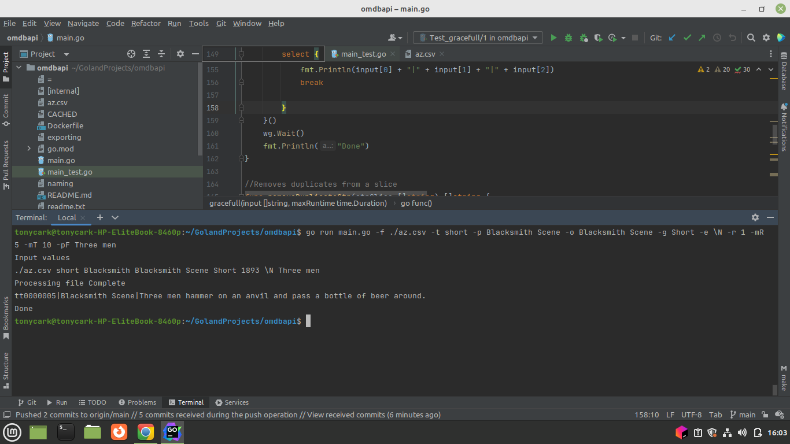

# OMDBAPI
reads an api and filters data

How to run the program
1. You can go ahead and create the docker image using the docker file and then just run the docker image as shown

2.Fill the flag options as shown in the diagram below:

What the program does:

Task 5.1: Whe the  program exceeds the maxRunTime, it  gracefully exit. All resources  released and any running goroutines is  stopped.Output printed . 
Task 5.2: When your program receives the SIGTERM signal, it gracefully exit. All resources  released and any running goroutines is stopped. 
Task 5.3: The program is   able to handle any rate limiting from omdbapi. It does  not panic or error.
Task 6.1: The program implements the maxRequests flag and fast exits when the limit is reached.
Task 6.2: My unit test coverage  is  88.4%

